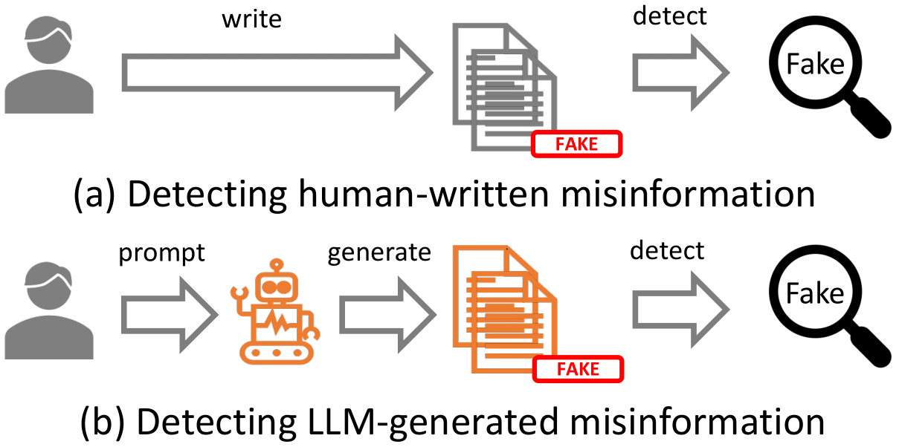

# Can LLM-Generated Misinformation Be Detected?

>The repository (dataset and code) for the ICLR 2024 paper **[Can LLM-Generated Misinformation Be Detected?](https://arxiv.org/abs/2309.13788)** <br> **Authors**: [Canyu Chen](https://canyuchen.com), [Kai Shu](http://www.cs.iit.edu/~kshu/)<br> **Paper** : [[arXiv]](https://arxiv.org/abs/2309.13788)<br> **Project Website** : [llm-misinformation.github.io](https://llm-misinformation.github.io/)<br>**TLDR** : We discover that LLM-generated misinformation ***can be harder*** to detect for humans and detectors compared to human-written misinformation with the same semantics, which suggests it can have ***more deceptive styles*** and potentially cause more harm.
>
> More resources on "**LLMs Meet Misinformation**" are also on the website: https://llm-misinformation.github.io/
>
>Any suggestion, comment or further discussion is welcome. Please let us know by email (cchen151@hawk.iit.edu) or wechat (alexccychen).

## Abstract
  

The advent of Large Language Models (LLMs) has made a transformative impact. However, the potential that LLMs such as ChatGPT can be exploited to generate misinformation has posed a serious concern to online safety and public trust. A fundamental research question is: ***will LLM-generated misinformation cause more harm than human-written misinformation?*** We propose to tackle this question from the perspective of ***detection difficulty***. We first build a taxonomy of LLM-generated misinformation. Then we categorize and validate the potential real-world methods for generating misinformation with LLMs. Then, through extensive empirical investigation, we discover that LLM-generated misinformation can be **harder** to detect for **humans** and **detectors** compared to human-written misinformation with the same semantics, which suggests it can have **more deceptive styles** and potentially cause **more harm**. We also discuss the implications of our discovery on combating misinformation in the age of LLMs and the countermeasures.

## Dataset: LLMFake

We construct the **LLMFake** dataset containing misinformation generated by **7 types of misinformation generators** (ChatGPT, Llama2-7b, Llama2-13b, Llama2-770b, Vicuna-7b, Vicuna-13b, and Vicuna-70b) and **7 types of misinformation generation methods** (Hallucinated News Generation, Totally or Partially Arbitrary Generation, Paraphrase Generation, Rewriting Generation, Open-ended Generation, and Information Manipulation). The misinformation generatetd by methods including Paraphrase Generation, Rewriting Generation, Open-ended Generation are based on three typical human-written misinformation dataset Politifact, Gossipcop and CoAID. Note that the datasets have been processed by filtering out the void generations.

The **human-written misinformation** and **LLM-generated misinformation** (using `gpt-3.5-turbo` as an example) datasets are stored in `experiment/data/chatgpt_3.5_generation/coaid`, `experiment/data/chatgpt_3.5_generation/gossipcop`, and `experiment/data/chatgpt_3.5_generation/politifact`. 

For example, the **human-written misinformation** for `politifact` is the `news_text` column in `experiment/data/chatgpt_3.5_generation/politifact/synthetic-gpt-3.5-turbo_politifact_paraphrase_generation_processed.csv`. 

The **ChatGPT-generated misinformation** for `politifact` via the `Paraphrase Generation` approach is the `synthetic_misinformation` column in `experiment/data/chatgpt_3.5_generation/politifact/synthetic-gpt-3.5-turbo_politifact_paraphrase_generation_processed.csv`.

## Experiment Results

Using ChatGPT-generated misinformation as an example, the prediction results of the detection process are recorded in `*.log` files in  `experiment/result_run1 (or result_run2, result_run3)/chatgpt_3.5_generation/coaid`, `experiment/result_run1  (or result_run2, result_run3)/chatgpt_3.5_generation/gossipcop`, and `experiment/result_run1  (or result_run2, result_run3)/chatgpt_3.5_generation/politifact`. Average performance over three runs are reported in the paper for ChatGPT-3.5 or GPT-4 as the detector due to the variance of the API output.

The outputs of LLM detectors for ChatGPT-generated misinformation are recorded in `*.log` files in `experiment/detection_script/politifact`, `experiment/detection_script/gossipcop_sampling`, and `experiment/detection_script/coaid_sampling`

## Reproduction
First, download our repo:
```bash
git clone https://github.com/llm-misinformation/llm-misinformation.git
cd llm-misinformation
```

Evironment setup (Note that we run the experiments on one NVIDIA RTX A6000. CUDA Version = 11.7. We adopt vllm==0.1.4 for the inference of Llama2):

```bash
conda create -n llm-misinformation python=3.8.17
pip install -r requirements.txt
```

As for ChatGPT-3.5 (`gpt-3.5-turbo`) or GPT4 (`gpt-4`) as the detectors, we adopt the default API setting of OpenAI. As for Llama2 (`Llama2-7B-chat` and `Llama2-13B-chat`), we adopt the hyperparameters for the sampling strategy as follows: `top_p = 0.9`, `temperature = 0.8`, `max_tokens = 2,000`.

To run the detection code, you need to replace the `args.OPENAI_API_KEY` in the `experiment/detection_script/llm_generated_misinformation_detector.py` to your own `OPENAI_API_KEY`. Then you can run the `*.sh` scripts in `experiment/detection_script/politifact`, `experiment/detection_script/gossipcop_sampling`, and `experiment/detection_script/coaid_sampling` to reproduce the results.

For example, adopting `Llama2-7B-chat` with the `Zero-shot Chain-of-Thought` prompting strategy as the detector for detecting ChatGPT-generated misinformation:
```bash
cd experiment/detection_script/politifact
bash run_detection_politifact_cot_single_run_llama2_7b.sh
```

## Ethics Statement

We aim to facilitate the research on combating LLM-generated misinformation by open-sourcing the **human-written misinformation** and **ChatGPT-generated misinformation** datasets and detection code. We do not release the generation code to avoid the potential misuse. 

## Citation
If you find our dataset or code useful, we will greatly appreacite it if you could consider citing our paper:
```
@inproceedings{chen2024llmgenerated,
      title={Can {LLM}-Generated Misinformation Be Detected?},
      author={Canyu Chen and Kai Shu},
      booktitle={The Twelfth International Conference on Learning Representations},
      year={2024},
      url={https://openreview.net/forum?id=ccxD4mtkTU}
      }

@article{chen2024combatingmisinformation,
      author = {Chen, Canyu and Shu, Kai},
      title = {Combating misinformation in the age of LLMs: Opportunities and challenges},
      journal = {AI Magazine},
      year = {2024},
      doi = {https://doi.org/10.1002/aaai.12188},
      url = {https://onlinelibrary.wiley.com/doi/abs/10.1002/aaai.12188},
      eprint = {https://onlinelibrary.wiley.com/doi/pdf/10.1002/aaai.12188}
      }
```

## Acknowledgement

This material is based upon work supported by the  U.S. Department of Homeland Security under Grant Award Number 17STQAC00001-07-04, and the Office of the Director of National Intelligence (ODNI), Intelligence Advanced Research Projects Activity (IARPA), via the HIATUS Program contract \#2022-22072200001, NSF SaTC-2241068, a Cisco Research Award, a Microsoft Accelerate Foundation Models Research Award. The views and conclusions contained in this document are those of the authors and should not be interpreted as necessarily representing the official policies, either expressed or implied, of the U.S. Department of Homeland Security, ODNI, IARPA, or the U.S. Government. The U.S. Government is authorized to reproduce and distribute reprints for governmental purposes notwithstanding any copyright annotation therein.

